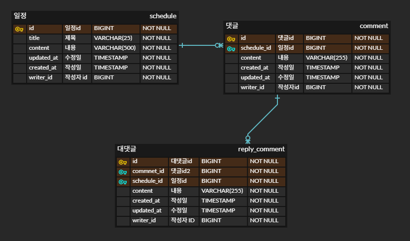

- ERD 

- API 명세서

[API 명세서](https://www.notion.so/teamsparta/1e62dc3ef5
1480f9ab17c47c05d699e9)

- 읽어주세요

정말 간단하게 CRUD 기능만 구현해 보았습니다.

"writerId" 같은 경우 단순히 User 기능이 구현되있지 않아 임시 인증 방법이라고 생각하시면 될 것 같습니다.

퀄리티가 낮다고... 생각하실 겁니다.. 사실 빠르게 끝내고 달리기 반 과제까지 도전 하려고 하였으나 취업 관련 이슈로 요즘 어떤 걸 공부해야할지 매우 혼란스러운 상태라.. 죄송합니다.. (꾸벅)

- 포스트 맨 Test
--- 
* 일정(Schedule)

* 댓글(Comment)

* 대댓글(Reply-Comment)

